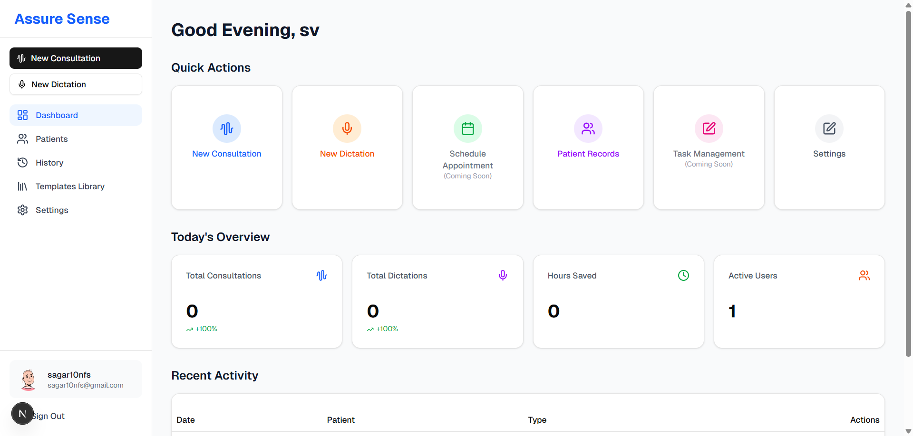

# Assure Sense (Astra Health Open Source Platform)

A comprehensive AI-powered clinical documentation platform with real-time speech recognition, intelligent template generation, and SOAP note automation.

## Showcase

### Clinical Document Templates

The platform can generate the following clinical documents using AI:

1. **Medical Certificate** - Official medical certificates for patients
2. **Patient Friendly Summary** - Easy-to-understand consultation summaries
3. **Mental Health Plan** - Comprehensive mental health treatment plans
4. **Referral Letter** - Professional referral letters to specialists
5. **Free Form Letter** - Customizable letters for various purposes
6. **Issues List** - Organized list of patient health issues
7. **SMART Goals** - Specific, Measurable, Achievable, Relevant, Time-bound goals
8. **Mental Health Consult** - Detailed mental health consultation notes
9. **Carers Certificate** - Certificates for patient carers
10. **Letter to Referring Doctor** - Professional correspondence with referring physicians
11. **SOAP Notes** - Structured Subjective, Objective, Assessment, Plan notes

### What we can build next

- Integration with EHR systems for seamless data exchange
- Correlate verbal descriptions with potential visual markers in medical imaging
- Population Health Analytics
- Sending automated reminders to patients for follow-ups and medication adherence using SMS/EMAIL delivery using agents.

### Features Added:

- Auth using native Supabase
- Ability to resume consultation
- Turborebo for faster development with Next16
- NLP as per the task
- Gemini for SOAP summary generation
- Exposure to Python Backend using Rest API deployed on docker

### Known Bugs:

Diarization bug: Return transcript events that include speaker labels in an utterances array are labeled as only Speaker[0].

## Getting Started

### Installation

1. Clone the repository and install dependencies:
   \`\`\`bash
   npm install
   \`\`\`

2. Set up environment variables:

   - Copy `.env.example` to `.env.local`
   - Fill in all required environment variables (see Environment Variables section below)

3. Run the database migration:

   - The SQL script in `scripts/001_create_schema.sql` will create all necessary tables

4. Start the Next.js development server:
   \`\`\`bash
   npm run dev
   \`\`\`

5. (Optional) Start the Python backend:
   \`\`\`bash
   cd python-backend
   pip install -r requirements.txt
   uvicorn main:app --reload --port 8000
   \`\`\`

Built with ❤️ for Open Source. Always.
